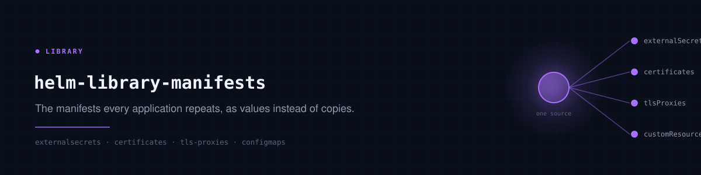

# helm-library-manifests

The manifests every application repeats — ExternalSecrets, a Certificate, an
nginx TLS proxy — as values against one chart instead of a hand-written chart per
application.

Used as a second source on the application that needs them, so they are part of
that application rather than a separate one.

## Using it

```yaml
# in argocd-core/<env>-aoa-values.yaml
- name: backstage-non-prod
  url: https://backstage.github.io/charts
  chart: backstage
  targetRevision: 2.8.2
  namespace: platform
  values: | ...
  extraSources:
    - url: git@github.com:polarpoint-io/helm-library-manifests.git
      path: .
      targetRevision: v2.2.0
      values: |
        global:
          syncWave: "-1"
        externalSecrets:
          - secretName: backstage-db
            namespace: platform
            refreshInterval: 5m
            data:
              - {secretKey: password, remoteRef: {key: backstage, property: postgres-password}}
        certificates:
          - {name: platform-tls, namespace: platform, host: platform.polarpoint.io}
        tlsProxies:
          - name: platform
            namespace: platform
            host: platform.polarpoint.io
            certSecret: platform-tls
            routes:
              - {path: "/", upstream: "http://backstage:7007", websocket: true}
```

Standalone still works — point an Application straight at it with `path: .` — but
as a second source the objects belong to the application that uses them.

## global.syncWave

Stamps every rendered object, so ordering is a property of the chart rather than
something each caller remembers. Set it negative and the secrets and certificates
land before the workload: an ExternalSecret arriving after the Deployment that
mounts it means a pod that starts, fails and backs off.

**Per-item annotations win.** An entry that sets its own
`argocd.argoproj.io/sync-wave` keeps it, so a chart ordering several resources
against each other is not flattened by a global default.

Unset by default, so a chart used on its own renders exactly as before.

## What it renders

| Key | Produces |
|---|---|
| `externalSecrets` | ExternalSecret, one per entry |
| `certificates` | cert-manager Certificate |
| `tlsProxies` | ConfigMap + Deployment + Service — the nginx TLS termination trio |
| `configMaps` | ConfigMap |
| `customResources` | arbitrary YAML, verbatim |
| `pvcs`, `pvs`, `dockerConfigs`, `jenkinsCredentials` | as named |

Prefer a typed entry where one exists. `customResources` gets no validation and
no defaults — it is the escape hatch for Crossplane Providers, ClusterIssuers and
RBAC, not the general case.

## Defaults worth knowing

**`global.secretStore`** is `cluster-secrets-store` / `ClusterSecretStore`. This
estate runs External Secrets with the Kubernetes provider and one
ClusterSecretStore per cluster; there is no Vault.

**ExternalSecret `name` defaults to `secretName`**, not `es-<secretName>`.
Renaming an ExternalSecret recreates it, and ESO then deletes the old target
Secret and makes a fresh one — anything mounting it gets a gap.

**Certificate `secretName` defaults to the Certificate's own name.** A `tlsProxy`
references the secret by name, and a mismatch fails at pod start with a missing
volume rather than at render.

## tlsProxies

Tailscale's `serve` only answers for its own `*.ts.net` SNI, so a vanity name
needs an L4 path — `tailscale.com/expose` on a Service forwarding raw TCP — and
something behind it to terminate TLS with the real certificate. cert-manager
issues it, nginx presents it, tailscale carries the packets.

Pair each `tlsProxies` entry with a `certificates` entry whose `secretName`
matches its `certSecret`.

| Option | For |
|---|---|
| `largeHeaders` | apps whose response headers overflow nginx's default buffers — shows up as a 502 on login rather than anything buffer-related |
| `maxBodySize` | upload limits; defaults to 50m |
| `routes[].websocket` | adds the Upgrade/Connection headers |
| `routes[].forwardedHost` | set false to match a proxy that never sent `X-Forwarded-Host` |
| `serverSnippet`, `routes[].snippet` | raw nginx, when the above is not enough |

## Versioning

Tagged, and consumers pin the tag. Several applications share this chart, so
tracking a branch would move all of them at once with no way to hold one back.

```sh
helm template x . -f your-values.yaml
```
